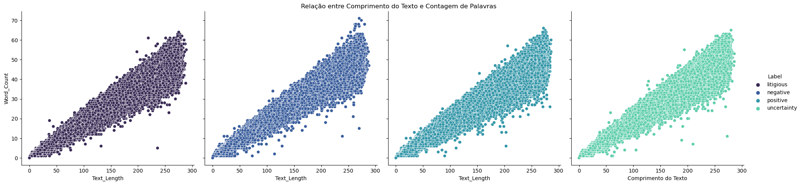
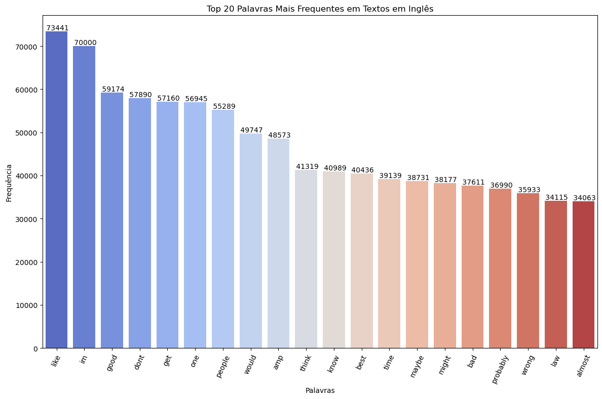
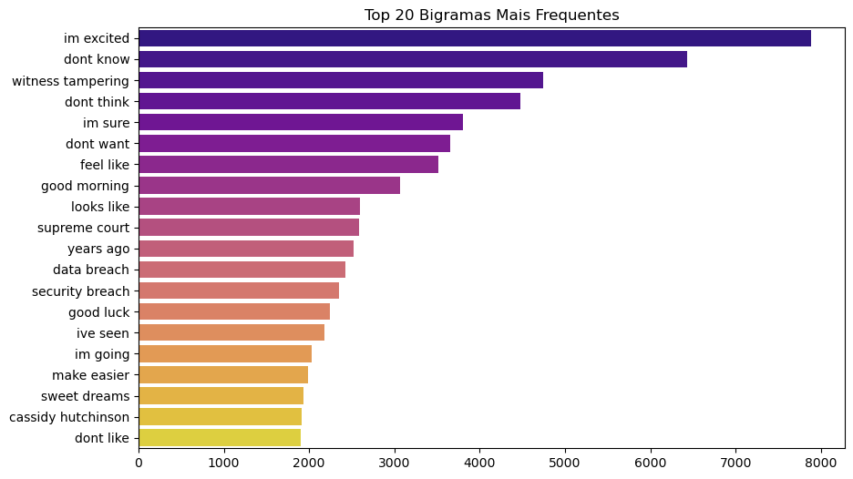

# Conhecendo os Dados

Nesta seção, apresentaremos uma análise detalhada e exploratória dos dados, com o objetivo de compreender sua estrutura, identificar possíveis outliers e avaliar as relações entre as variáveis analisadas.

Faremos uso de medidas de tendência central, dispersão, gráficos e técnicas apropriadas para obter insights significativos sobre o conjunto de dados.

## Estrutura dos Dados

O conjunto de dados selecionado foi o *"Sentiment Dataset with 1 Million Tweets - MUHAMMAD TARIQ"*, o data set conta com um um total de **9378.854 linhas**, organizadas em **3 colunas**, sendo desses **929.544 valores únicos por colunas**, mas também conta com um débito de **23 linguagens sem dados informados**.
Abaixo está a estrutura do conjunto de dados:

|  |Text|Language|Label|
|--|----|--------|-----|
|0|@Charlie_Corley @Kristine1G @amyklobuchar @Sty...|en|`litigious`|
|1|`https://t.co/YJNiO0p1JV` Flagstar Bank disclose...|en|`negative`|
|2|Rwanda is set to host the headquarters of Unit...|en|`positive`|

- A coluna **Text**, representa o conteúdo dos tweets, neles estão inclusos URL´s, menções e hashtags, por se tratar de um texto a priori sem polimento.

- A coluna **Language**, indica o idioma em que o tweet correponde foi escrito, no dataset selecionado, possuímos diversos idiomas, mas a maior ocorrência de amostral está no idioma en - Inglês.

- A coluna **Label**, é responsável por categorizar os textos com seus respectivos sentimentos, possuímos 4 tipos de classificações possíveis, são elas:
> `litigious`, `negative`, `positive` e     `uncertainty`.

## Limpeza e Preparação dos Dados

Antes de avançarmos com a análise, conduzimos uma etapa de pré-processamento dos dados, na qual removemos URLs, menções, hashtags e caracteres especiais dos textos usando expressões regulares.

```python 
# Aplicando a limpeza de texto na coluna 'Language'. Foram encontrados links de imagens, o que não é relevante para a análise
df['Language'] = df['Language'].astype(str).apply(clean_text)

df.drop(df[df['Language'].astype(str).apply(lambda x: len(x) > 3)].index, inplace=True)
```

> Uma expressão regular, também conhecida como regex, é uma sequência de caracteres que define um padrão de busca em textos. Ao usar expressões regulares, você pode realizar operações como encontrar padrões específicos em um texto, validar se uma string está formatada corretamente, extrair partes específicas de um texto, substituir partes de um texto por outras e muito mais.

Adicionalmente, foi gerada uma nova coluna chamada `Clean_Text`, que contém o texto do Tweet limpo.

```python 
# Aplicando a limpeza de texto na coluna 'Text' para remover URLs, menções, hashtags, caracteres especiais e números
df['Clean_Text'] = df['Text'].astype(str).apply(clean_text)
```

Além disso, tratamos valores ausentes na coluna `Language`, preenchendo-os com uma string vazia, e removemos duplicatas do conjunto de dados.

```python 
# Tratando valores ausentes na coluna 'Language', preenchendo com vazio ('') para evitar problemas na análise de texto
df['Language'].fillna('', inplace=True)

# Remoção de duplicatas
df.drop_duplicates(inplace=True)
```

Como etapa adicional de engenharia de recursos, criamos duas novas colunas: `Text_Length` e `Word_Count`, que representam o comprimento do texto limpo e a contagem de palavras, respectivamente.

```python 
# Feature Engineering: Criando novas features com base no texto limpo 
# Contagem de palavras e comprimento do texto
df['Text_Length'] = df['Clean_Text'].apply(len)
df['Word_Count'] = df['Clean_Text'].apply(lambda x: len(x.split()))  
```

Com o conjunto de dado, devidamente tratado, partimos para a etapa de análise do data set selecionado.

## Análise Univariada

O gráfico abaixo ilustra a distribuição da quantidade de tweets por idioma, considerando os 5 idiomas com mais informações no conjunto de dados.

> **Nota**: Selecionamos os 5 principais idiomas para gerar o gráfico abaixo, devido à disparidade das informações apresentadas nos demais idiomas, as quais têm um impacto mínimo na análise subsequente.


>*Gráfico: Distribuição de Quantidade de Tweets x Idiomas*

Para gerar essas informações, foi realizada a análise exploratório de dados(AED), Univariada com gráficos.

Esse método, consiste em se concentrar na análise de uma única variável por vez. Em outras palavras, ela examina as características e distribuição de uma variável isoladamente, sem considerar sua relação com outras variáveis. Neste caso, é utilizado a informação do idioma, para calcular sua respectiva quantidade de tweets.

Utilizando o mesmo processo de análise, o gráfico abaixo ilustra a distribuição dos rótulos no conjunto de dados.


>*Gráfico: Distribuição de Rótulos*

## Análise Bivariada

O gráfico abaixo ilustra a relação entre rótulos/labels e os idiomas, considerando os 5 idiomas com mais informações no conjunto de dados.

> **Nota**: Podemos observar que, no gráfico, os rótulos que indicam a quantidade de valores estão visíveis apenas para o idioma Inglês, enquanto para os outros idiomas não estão. Devido à grande disparidade nos valores, decidimos remover os rótulos dos outros idiomas para manter a clareza e evitar poluição visual do gráfico.


>Gráfico: Relação entre Rótulos e Idiomas

É possível observar que alguns idiomas apresentam uma distribuição mais equilibrada de rótulos, enquanto outros têm uma predominância de um ou dois rótulos específicos

Para gerar essas informações, foi realizada a análise exploratório de dados(AED), Bivariada com gráficos.

Uma análise bivariada é uma técnica estatística usada para examinar a relação entre duas variáveis. Isso significa que você está interessado em entender como uma variável se comporta em relação à outra.

O objetivo é entender se há uma associação entre as duas variáveis e, em caso afirmativo, qual é a natureza dessa associação (positiva, negativa, fraca, forte, etc.).

Utilizando o mesmo processo de análise, o gráfico de dispersão abaixo ilustra a relação entre o comprimento do texto limpo e a contagem de palavras, com os pontos coloridos de acordo com o rótulo. É possível observar uma correlação positiva entre essas duas variáveis, o que é esperado, pois textos mais longos tendem a ter mais palavras.


>Gráfico: Relação entre Comprimento do Texto e Contagem de Palavras(Separado por labels)

## Identificação de Outliers

Para identificar outliers no comprimento dos textos, utilizamos os quantis 0.05 e 0.95 como limites inferior e superior, respectivamente. Essa abordagem é comum para remover os casos extremos, que podem afetar negativamente a análise.

Identificamos **88.239 outliers** com base no comprimento do texto. Ao analisar a distribuição desses outliers por rótulo, observamos que a maioria pertence às categorias "negative" e "positive".

Posteriormente, removemos os outliers do conjunto de dados, mantendo apenas 5% dos dados com menor e maior comprimento de texto.

```python
# Identificando outliers no comprimento do texto com base 
outliers = df[(df['Text_Length'] > df['Text_Length'].quantile(0.95)) | (df['Text_Length'] < df['Text_Length'].quantile(0.05))]

# Removendo outliers com base no comprimento do texto (5% dos dados com menor e maior comprimento) para evitar viés na análise
df_filtered = df[~((df['Text_Length'] > df['Text_Length'].quantile(0.95)) | (df['Text_Length'] < df['Text_Length'].quantile(0.05)))]
```

Abaixo, por meio dos gráficos de distribuição de sentimentos usando dados exclusivamente na língua inglesa, é possível observar a variação dos valores com e sem a aplicação de outliers no conjunto de dados selecionado.


>Gráfico: Distribuição dos Sentimentos nos Textos em Inglês - Com Outliers


>Gráfico: Distribuição dos Sentimentos nos Textos em Inglês - Outliers Removidos

Através da análise dos gráficos, é possível perceber uma pequena variação entre os valores dos sentimentos distribuídos, onde nenhum deles ultrapassa a margem de 10% de diferença. São eles:

`positive`:
- Com Outliers: 247.254 
- Sem Outliers: 223.975
>Diferença de 23.279(9,41%)

`negative`:
- Com Outliers: 243.139 
- Sem Outliers: 219.428
>Diferença de 23.711(9,75%)

`litigious`:
- Com Outliers: 178688 
- Sem Outliers: 165168
>Diferença de 13.520(7,56%)

`uncertainty`:
- Com Outliers: 198.097 
- Sem Outliers: 186.379
>Diferença de 11.718(5,91%)

## Word Cloud

Uma Word Cloud é uma representação visual das palavras mais frequentes em um texto. Geramos Word Clouds separadas para os textos classificados com seus respectivos rótulos/labels, o que nos permite identificar visualmente as palavras mais proeminentes em cada sentimento.

A Word Cloud abaixo mostra as palavras mais frequentes nos textos em inglês, sem distinção de sentimento.


>Gráfico: Word Cloud para Texto Limpo em Inglês


As Word Clouds abaixo mostram as palavras mais frequentes nos textos em inglês, distintas por rótulos/labels.


>Gráfico: Palavras Mais Frequentes em Tweets Positivos


>Gráfico: Palavras Mais Frequentes em Tweets Negativos


>Gráfico: Palavras Mais Frequentes em Tweets de Incerteza


>Gráfico: Palavras Mais Frequentes em Tweets de Desavenças (Litigiosos)

As Word Clouds separadas nos permitem comparar as palavras mais proeminentes em cada sentimento, fornecendo insights sobre os tópicos e contextos comuns em cada categoria.

## Análise de Comprimento de Texto

>Gráfico: Boxplot do Comprimento dos Textos em Inglês

Neste boxplot, estamos visualizando a distribuição do comprimento dos textos em inglês. O boxplot é uma ferramenta gráfica que nos permite ver a mediana, os quartis e os valores atípicos (outliers) de uma distribuição. A linha dentro da caixa indica a mediana dos dados, que representa o valor central da distribuição do comprimento dos textos.

As extremidades da caixa, conhecidas como o primeiro e terceiro quartis, marcam a metade inferior e superior dos dados, respectivamente. A distância entre esses quartis, chamada de intervalo interquartílico (IQR), é uma medida de dispersão e nos mostra onde está concentrada a maioria dos nossos dados.

As linhas que se estendem verticalmente a partir da caixa, conhecidas como 'whiskers', indicam a variabilidade fora do quartil superior e inferior, e qualquer ponto fora dessas linhas é considerado um outlier. Esses são valores que se desviam significativamente do resto da distribuição e podem representar textos anormalmente longos ou curtos.

Observando nosso boxplot, podemos ver que a maioria dos textos tem um comprimento que varia de forma bastante consistente, mas há alguns textos que são excepcionalmente longos, conforme indicado pelos pontos além do 'whisker' superior. Isso sugere que, embora a maioria dos textos esteja dentro de um intervalo de comprimento esperado, existem casos que podem requerer atenção especial ou análise adicional para entender por que se destacam.

## Análise de Frequência de Palavras


>Gráfico: Top 20 Palavras Mais Frequentes

Neste gráfico, estamos visualizando as 20 palavras mais frequentes encontradas em um conjunto de textos em inglês. A altura de cada barra indica a frequência da palavra correspondente no dataset analisado.

Começando pela barra mais alta, 'like' aparece como a palavra mais frequente com um total de **73.441 ocorrências**, seguida de 'I'm' com aproximadamente **70.000 ocorrências**, e assim por diante. É interessante notar como termos comuns e de uso genérico dominam a lista, o que é típico em análises de frequência de palavras em dados de texto grande.

Palavras como 'good', 'don't', 'get', e 'one' são exemplos de termos que poderíamos esperar ver com alta frequência, pois são geralmente usadas em diversos contextos. Já palavras como 'bad', 'probably', 'wrong', 'say', e 'almost', que aparecem no final do nosso top 20, ainda são relativamente comuns, mas com uma frequência menor comparada às primeiras.

A distribuição de frequências aqui mostra que a variação não é uniforme; ela diminui de maneira significativa da palavra mais comum para a vigésima. Isso sugere uma dispersão ampla na frequência de uso das palavras dentro do corpus analisado.

O uso de diferentes tonalidades de azul para as barras mais frequentes e depois transitando para o vermelho ajuda a destacar visualmente essa variação decrescente na frequência das palavras. Cada barra está rotulada com o número exato de ocorrências, proporcionando clareza e facilitando a interpretação precisa dos dados.

Essa visualização é fundamental para compreender não apenas o léxico comum em um conjunto de dados textuais, mas também para iniciar análises mais profundas, como a identificação de tendências de linguagem ou a preparação de dados para processamento de linguagem natural, onde palavras de alta frequência podem ser tratadas como 'stop words' e removidas para focar em termos mais significativos para análises específicas.

## Análise de Sentimentos vs. Comprimento do Texto


>Gráfico: Comprimento dos Textos por Sentimento

Este boxplot ilustra a distribuição do comprimento dos textos categorizados por quatro diferentes sentimentos: litigioso, positivo, negativo e incerteza. As caixas representam a faixa interquartil, que engloba o meio de cada distribuição, com as linhas horizontais internas marcando as medianas. Podemos observar que todos os sentimentos apresentam distribuições com medianas similares, o que sugere que, independentemente do sentimento, o comprimento dos textos tende a ser consistente. 

Os 'bigodes' do boxplot, ou as linhas que se estendem das caixas, indicam a variabilidade fora dos quartis superiores e inferiores, e os círculos representam os outliers, ou pontos de dados que se destacam significativamente das outras observações. É notável a presença de diversos outliers em todos os sentimentos, especialmente no positivo e no negativo, indicando textos excepcionalmente longos em comparação com a maioria.

Com base nessa visualização, concluímos que, enquanto a centralidade do comprimento dos textos é semelhante através dos sentimentos, a dispersão e os outliers sugerem variações no comprimento que podem estar associadas a características específicas dos sentimentos expressos nos textos.

## Análise de Bigramas e Trigramas


>Gráfico: Top 20 Bigramas Mais Frequentes

Este gráfico de barras horizontal exibe os 20 bigramas mais frequentes encontrados no nosso conjunto de dados de texto em inglês. Bigramas são pares de palavras consecutivas que, quando analisados juntos, podem oferecer insights sobre temas e padrões comuns na linguagem. 

Começando no topo, o bigrama 'im excited' lidera com a maior frequência, indicando um sentimento positivo que aparece frequentemente nos textos. Seguem-se outros bigramas comuns como 'dont know' e 'witness tampering', que podem sugerir temas de incerteza ou contextos legais, respectivamente. A presença de termos como 'supreme court', 'data breach', e 'security breach' indica discussões em torno de assuntos legais e de segurança de informações. 

Esses bigramas frequentes variam desde expressões cotidianas como 'good morning' até termos específicos como 'cassidy hutchinson', que pode ser um nome próprio. Os diferentes tons de cor das barras facilitam a distinção visual entre as posições relativas dos bigramas, enquanto as linhas numéricas permitem uma compreensão quantitativa da frequência de cada bigrama.

A análise destes bigramas pode ser particularmente útil para entender as conversas e preocupações predominantes dentro do corpus analisado, auxiliando em pesquisas que requerem conhecimento sobre o uso contextual das palavras.


>Gráfico: Top 20 Trigramas Mais Frequentes

Este gráfico de barras horizontal apresenta os 20 trigramas mais frequentes encontrados em nosso conjunto de dados de textos em inglês. Um trigrama é uma sequência de três palavras consecutivas, e a análise de sua frequência pode nos dar uma visão profunda dos temas e padrões linguísticos prevalentes

Este gráfico de barras horizontal apresenta os 20 trigramas mais frequentes encontrados em nosso conjunto de dados de textos em inglês. Um trigrama é uma sequência de três palavras consecutivas, e a análise de sua frequência pode nos dar uma visão profunda dos temas e padrões linguísticos prevalentes no corpus analisado. 

No topo da lista, com a frequência mais alta, temos o trigrama "secret service agent", que poderia indicar discussões em torno de tópicos de segurança ou políticos. Seguem-se expressões como "surprisingly controversial topics" e "controversial topics cup", sugerindo debates ou discussões sobre assuntos potencialmente polêmicos. 

Os trigramas menos frequentes incluem "make life easier" e "makes perfect sense", que podem ser associados a textos com teor explicativo ou instrutivo. 

Observamos também trigramas como "dream come true" e "dreams come true", que refletem um conteúdo possivelmente otimista ou inspirador.

A distribuição das frequências nos ajuda a entender quais tópicos ou expressões são mais discutidos ou mencionados, oferecendo um ponto de partida para análises textuais mais detalhadas, como a identificação de tendências, o sentimento geral do corpus ou a prevalência de certos tópicos de conversação.

## Análise de Densidade e Distribuição


>Gráfico: Distribuição de Densidade do Comprimento dos Textos

Este gráfico de densidade mostra a distribuição do comprimento dos textos em nosso dataset. A curva representa onde os comprimentos dos textos se concentram: há um pico inicial que sugere que muitos dos textos são relativamente curtos, e a curva decresce indicando que textos mais longos são menos frequentes.

A média de comprimento do texto, marcada pela linha azul pontilhada, está em torno de **89.11 caracteres**, enquanto a mediana, representada pela linha verde pontilhada, está em **79 caracteres**. A diferença entre a média e a mediana indica a presença de textos muito longos no conjunto de dados, o que distorce a média para um valor maior.

Podemos concluir que, apesar da existência de textos mais longos, a maioria dos textos no nosso corpus tende a ser mais concisa, como refletido pela mediana e pelo pico da distribuição. Isso é típico em análises de texto onde brevidade é comum, como em postagens de mídias sociais ou mensagens de texto.

## Descrição dos Achados

Realizamos uma análise detalhada do balanceamento de rótulos por idioma, calculando a proporção de cada rótulo para cada idioma presente no conjunto de dados.

Observamos que alguns idiomas apresentam uma distribuição relativamente equilibrada de rótulos, enquanto outros têm uma predominância significativa de um ou dois rótulos específicos. Essa análise pode ser importante para avaliar a necessidade de técnicas de balanceamento de dados ou estratégias de treinamento específicas para determinados idiomas.

A partir da análise descritiva e exploratória realizada, destacamos os seguintes achados relevantes:

1. Observamos uma predominância de tweets em inglês no conjunto de dados, seguidos por francês, espanhol e português. Essa distribuição de idiomas pode influenciar as abordagens e ferramentas utilizadas para o processamento de linguagem natural.

2. O conjunto de dados original, na linguagem inglesa, apresentava uma discrepância entre os diferentes rótulos ("positive", "negative", "litigious" e "uncertainty"), os valores conferidos foram os seguintes:

- `positive`: 247.254.
- `negative`: 243.139.
- `uncertainty`: 198.097.
- `litigious`: 178.688.

Ao analisarmos a distribuição das discrepâncias dos rótulos com base no maior deles, o rótulo `positive`, podemos observar que os rótulos `uncertainty` e `litigious` apresentam um valor consideravelmente menor em comparação com a diferença do rótulo `negative`:

- `negative`: (-1,66%).
- `uncertainty`: (-19,8%).
- `litigious`: (-27,7%).

3. Após a limpeza e preparação dos dados, identificamos outliers com base no comprimento do texto. Esses outliers foram removidos para evitar que influenciassem negativamente a análise, os valores conferidos foram os seguintes:

- `positive`: 223.975.
- `negative`: 219.428.
- `uncertainty`: 186.379.
- `litigious`: 165.168.

Após remoção dos outliers, a distribuição das discrepâncias dos rótulos com base no maior deles, ficou assim:

- `negative`: (-2,03%).
- `uncertainty`: (-16,78%).
- `litigious`: (-26,25%).

Constatando uma variação irrisória, entretanto, existente com a aplicabilidade dos outliers.

4. A análise de frequência de palavras e bigramas complementou os insights obtidos pelas Word Clouds, quantificando as palavras e combinações mais frequentes nos textos.

5. A análise de densidade e distribuição do comprimento dos textos revelou a distribuição subjacente dos dados, permitindo identificar eventuais desvios ou assimetrias.

Com base nos insights obtidos, decidimos focar nossa análise adicional apenas em postagens em inglês. Essa escolha foi motivada por várias razões:

1. **Padronização Linguística**: O inglês é amplamente utilizado em dados de mídia social e fornece uma base consistente para análise, minimizando a complexidade associada ao processamento de múltiplos idiomas.

2. **Disponibilidade de Ferramentas**: Existem muitas bibliotecas e ferramentas de processamento de linguagem natural (PLN) otimizadas para o inglês, facilitando a aplicação de técnicas avançadas.

3. **Amostragem de dados consistente**: O conjunto de dados teve uma coleta de amostras mais confiável em inglês, o que o torna mais seguro e eficaz quando aplicado especificamente nesse idioma em comparação com todos os outros no conjunto de dados. Isso é válido até mesmo para a extração de dados e análises.

## Ferramentas Utilizadas

As seguintes ferramentas e bibliotecas foram utilizadas na análise exploratória dos dados:

- **Python**: A linguagem de programação Python foi utilizada para implementar todas as análises e visualizações.
- **Pandas**: Esta biblioteca Python foi usada para manipulação e limpeza dos dados, bem como para operações básicas de análise de dados.
- **Matplotlib**: Biblioteca de visualização de dados em Python, utilizada para criar gráficos estáticos, como gráficos de barras, boxplots e gráficos de dispersão.
- **Seaborn**: Biblioteca de visualização de dados em Python, construída sobre Matplotlib, que fornece uma interface mais amigável e recursos avançados para criação de gráficos estatísticos.
- **Regex** (Expressões Regulares): Utilizada para realizar operações de limpeza de texto, como remoção de URLs, menções e hashtags.
- **NLTK** (Natural Language Toolkit): Biblioteca Python para processamento de linguagem natural, utilizada para remover stopwords dos textos.
- **WordCloud**: Biblioteca Python para criar visualizações de nuvem de palavras, utilizada para gerar Word Clouds.
- **Scikit-learn**: Biblioteca Python para aprendizado de máquina, utilizada para realizar análise de bigramas e trigramas.

Essas ferramentas foram escolhidas por sua ampla adoção na comunidade de ciência de dados, recursos poderosos e documentação abrangente. Elas nos permitiram realizar uma análise exploratória rica e obter insights valiosos sobre o conjunto de dados.
