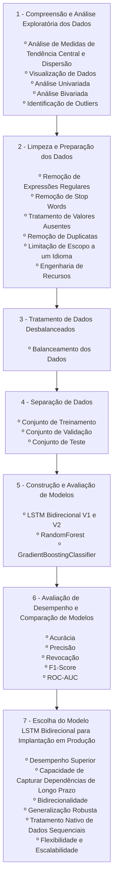

# Preparação dos dados

A preparação de dados é um componente crítico no processo de aprendizado de máquina, que diretamente influencia a performance e eficácia dos modelos construídos. No contexto do conjunto de dados "**Sentiment Dataset with 1 Million Tweets - MUHAMMAD TARIQ**", utilizamos um conjunto abrangente de técnicas de pré-processamento e tratamento de dados para maximizar a qualidade e a relevância das informações disponíveis.

## **Limpeza de Dados**

Neste projeto, a limpeza de dados incluiu as seguintes etapas:

- Remoção de expressões regulares(Urls, menções, hashtags e caracteres especiais);
```python 
def clean_url_mentions(text: str) -> str:
"""Remove URLs e menções de usuários do texto.

Args:
    text (str): Texto original.
    
Returns:
    str: Texto limpo sem URLs e menções.
"""
text = re.sub(r'http\S+', '', text)  # Remove URLs que começam com http
text = re.sub(r"www.\S+", '', text)  # Remove URLs que começam com www
text = re.sub(r'@[A-Za-z0-9_]+', '', text)  # Remove menções a usuários
return text

def clean_hashtags_special_chars(text: str) -> str:
"""Remove hashtags e caracteres especiais do texto.

Args:
    text (str): Texto a ser limpo.
    
Returns:
    str: Texto limpo de hashtags e caracteres não alfabéticos.
"""
text = re.sub(r'#[A-Za-z0-9_]+', '', text)  # Remove hashtags
text = re.sub(r'[^a-zA-Z\s]', '', text)  # Remove caracteres que não são letras ou espaços
return text

def clean_text(text: str) -> str:
"""Orquestra a limpeza de URLs, menções, hashtags e caracteres especiais no texto.

Args:
    text (str): Texto original possivelmente contendo URLs, menções, hashtags e caracteres especiais.

Returns:
    str: Texto limpo.
"""
if pd.isnull(text):
    return ""
text = clean_url_mentions(text)
text = clean_hashtags_special_chars(text)
return re.sub(r'\s+', ' ', text).strip()  # Reduz múltiplos espaços para um único espaço
```

- Remoção de Stop Words (palavras comuns que aparecem com frequência, mas não agregam sentido/valor à frase, exemplo, artigos e preposições, o/a/um/e...);
```python
def remove_stopwords(text: str) -> str:
"""Remove palavras de parada (stopwords) do texto.

Args:
    text (str): Texto original tokenizado.

Returns:
    str: Texto sem stopwords.
"""
tokens = word_tokenize(text)  # Tokeniza o texto em palavras individuais
return ' '.join([token.lower() for token in tokens if token.lower() not in STOP_WORDS_EN])
```

- Duplicatas foram eliminadas para evitar redundâncias que poderiam distorcer as análises;
```python
# Filtra por idioma inglês
df_filtered = df_filtered.drop_duplicates(subset=['Clean_Text'])  # Remove textos duplicados
```

- Limitação do escopo dos dados apenas para a linguagem inglesa.
```python
# Filtra por idioma inglês 
df_filtered = df[(df['Language'] == 'en')].copy()
```


>*Gráfico: Distribuição de Quantidade de Tweets x Idiomas*

## **Tratamento de dados desbalanceados**
>Valores antes do balanceamento dos rótulos:
>
>`positive`: 229.658
>
>`negative`: 221.604
>
>`uncertainty`: 188.989
>
>`litigious`: 164.189
```python
def balance_labels(df: pd.DataFrame, labels: List[str]) -> pd.DataFrame:
"""Realiza undersampling para balancear os rótulos.

Args:
    df (pd.DataFrame): Dataframe com desbalanceamento de rótulos.
    labels (List[str]): Lista de rótulos a serem balanceados.

Returns:
    pd.DataFrame: Dataframe com rótulos balanceados.
"""
label_counts = df['Label'].value_counts()
min_count = label_counts.min()
dfs = []
for label in labels:
    df_label = df[df['Label'] == label]
    df_label_downsampled = resample(df_label, replace=False, n_samples=min_count, random_state=42)
    dfs.append(df_label_downsampled)
return pd.concat(dfs).sample(frac=1).reset_index(drop=True)

# Balanço de Rótulos
labels = ['positive', 'negative', 'uncertainty', 'litigious']
df_balanced = balance_labels(df_processed, labels)
print(df_balanced['Label'].value_counts())  # Mostra a distribuição dos rótulos após balanceamento
```
>Valores após balanceamento dos rótulos:
>
>`positive`: 164.189
>
>`negative`: 164.189
>
>`uncertainty`: 164.189
>
>`litigious`: 164.189

Exemplo dos dados após realização do balanceamento dos rótulos:
| |Clean_Text|Label|
|-|----------|------|
|0|maybe dont think theyd bigger pull big personally|`uncertainty`|
|1|every time something bad happens kids nobody b...|`litigious`|
|2|rhetorical question yes|`negative`|
|3|brilliant account laugh good gets sides|`positive`|
|4|wall accident|`negative`|

## **Separação de dados**

Dividimos os dados em três conjuntos distintos para garantir uma avaliação precisa e eficaz do desempenho dos modelos:

* Conjunto de Treinamento: Utilizado para treinar os modelos. Representa 80% dos dados disponíveis.
* Conjunto de Validação: Utilizado durante a validação cruzada para ajuste de hiperparâmetros.
* Conjunto de Teste: Utilizado para avaliar a performance final dos modelos. Representa 20% dos dados.

```python

def prepare_data(df: pd.DataFrame) -> Tuple[np.ndarray, np.ndarray, np.ndarray, np.ndarray, LabelEncoder]:
    df['Clean_Text_LSTM'] = df['Clean_Text_LSTM'].fillna('').astype(str)
    texts = df['Clean_Text_LSTM'].apply(lambda x: x.split()).values
    
    encoder = LabelEncoder()
    labels = encoder.fit_transform(df['Label'])
    
    # Imprime os labels e seus códigos
    print("Classes codificadas e seus códigos:")
    for label, code in zip(encoder.classes_, range(len(encoder.classes_))):
        print(f"Label '{label}' é codificado como {code}")
    print("")
    
    return train_test_split(texts, labels, test_size=0.2, random_state=42, stratify=labels), encoder

```

## **Manuseio de Dados Temporais**

Como o dataset utilizado para análise de sentimentos no Twitter não possui uma variável de tempo, o manuseio de dados temporais não se aplica neste caso. Portanto, essa etapa é ignorada no pipeline de preparação de dados.


## **Redução de Dimensionalidade**

Como o dataset possui apenas a variável de texto, técnicas de redução de dimensionalidade como PCA não são necessárias. A vetorização do texto usando técnicas como TF-IDF já proporciona uma representação adequada dos dados em um espaço de menor dimensão.

## **Validação Cruzada**

Utilizamos a técnica de validação cruzada para garantir a robustez do modelo e avaliar seu desempenho de forma mais confiável.

```python
from sklearn.model_selection import cross_val_score
from sklearn.ensemble import RandomForestClassifier

# Definindo o modelo
model = RandomForestClassifier(n_estimators=100, random_state=42)

# Validação cruzada
scores = cross_val_score(model, X_reduced, train_data['Label'], cv=5)
print(f'Scores de validação cruzada: {scores}')
```

## **Monitoramento Contínuo**

Implementamos um pipeline de monitoramento contínuo para ajustar e adaptar o pré-processamento conforme necessário ao longo do tempo. Esse pipeline inclui a reavaliação periódica dos dados e dos modelos para garantir que permanecem eficazes e relevantes.

# Descrição dos modelos

Nesta seção, apresentamos uma descrição detalhada dos algoritmos de aprendizado de máquina utilizados na construção dos modelos de análise de sentimentos. Abordamos os conceitos fundamentais, princípios de funcionamento, vantagens e limitações de cada algoritmo, além de justificar a escolha dos mesmos.

## Modelos de Redes Neurais - LSTM Bidirecional

### Conceito e Funcionamento

As Redes Neurais Recorrentes (RNNs) são uma classe de redes neurais adequada para dados sequenciais, como texto. Dentro dessa classe, a arquitetura Long Short-Term Memory (LSTM) é uma variante que resolve o problema de dependência de longo prazo, possibilitando a manutenção de informações relevantes ao longo de extensas sequências. No caso do LSTM Bidirecional, a arquitetura é estendida para processar a informação em ambas as direções (frente e verso), proporcionando um contexto mais completo para cada ponto da sequência.

### Configurações Utilizadas

- **Dimensões do Embedding e Camadas Ocultas**: 512
- **Número de Camadas**: 3
- **Taxa de Dropout**: 0.5
- **Número de Épocas**: 50
- **Tamanho do Lote**: 64
- **Comprimento Máximo de Texto**: 128 caracteres

### Justificativa da Escolha

O modelo LSTM Bidirecional foi escolhido devido à sua capacidade de capturar dependências de longo prazo e seu desempenho comprovado em tarefas de Processamento de Linguagem Natural (PLN). A bidirecionalidade oferece uma vantagem adicional ao considerar o contexto completo de cada palavra no texto, o que é crucial para a análise de sentimentos.

### Variações e Hiperparâmetros

- **LSTM Bidirecional V1**: Taxa de aprendizado de 0.0001.
- **LSTM Bidirecional V2**: Taxa de aprendizado de 0.001.

A variação na taxa de aprendizado foi introduzida para investigar seu impacto na convergência e estabilidade do treinamento.

## Modelos de Aprendizado de Máquina Clássicos

### RandomForest

#### Conceito e Funcionamento

RandomForest é um método de ensemble learning que utiliza múltiplas árvores de decisão para melhorar a precisão e evitar overfitting. Cada árvore é treinada com um subconjunto aleatório dos dados e características, e a decisão final é baseada na média ou maioria das predições individuais das árvores.

#### Configurações Utilizadas

- **Número de Árvores**: 500
- **Profundidade Máxima**: 50
- **Critérios de Divisão**: `gini`

#### Justificativa da Escolha

RandomForest foi escolhido devido à sua robustez e capacidade de lidar com datasets de alta dimensionalidade e variabilidade. É eficaz em evitar overfitting e proporciona uma boa interpretação dos dados através da análise de importância das características.

### GradientBoostingClassifier

#### Conceito e Funcionamento

GradientBoostingClassifier é um método de boosting que constrói árvores de decisão sequencialmente, onde cada nova árvore corrige os erros das anteriores. Este método é conhecido por sua alta precisão e capacidade de ajuste fino aos dados.

#### Configurações Utilizadas

- **Número de Árvores**: 500
- **Taxa de Aprendizado**: 0.01
- **Profundidade Máxima**: 3

#### Justificativa da Escolha

GradientBoostingClassifier foi escolhido pela sua habilidade de melhorar progressivamente o desempenho através do ajuste de erros residuais. É particularmente útil em datasets complexos e heterogêneos, oferecendo um alto grau de precisão.

## Ajuste de Hiperparâmetros

Para ambos os modelos clássicos, utilizamos a busca em grade (Grid Search) e a busca aleatória (Randomized Search) para identificar as melhores combinações de hiperparâmetros. A validação cruzada foi aplicada para garantir a robustez dos modelos e prevenir overfitting.

### Exemplo de Pipeline de Busca Aleatória

```python
from sklearn.model_selection import RandomizedSearchCV

# Definição do pipeline
pipeline = Pipeline([
    ('clf', RandomForestClassifier(random_state=42))
])

# Parâmetros para busca aleatória
param_grid = {
    'clf__n_estimators': [100, 300, 500],
    'clf__max_depth': [10, 30, 50],
    'clf__min_samples_split': [2, 5, 10],
    'clf__min_samples_leaf': [1, 2, 4],
    'clf__max_features': ['auto', 'sqrt', 'log2']
}

# Configuração da busca aleatória
search = RandomizedSearchCV(pipeline, param_grid, n_iter=100, cv=5, scoring='accuracy', n_jobs=-1, verbose=2, random_state=42)
search.fit(X_train_tfidf, y_train)

# Melhores hiperparâmetros
print(search.best_params_)
```

# Avaliação dos modelos criados

## Métricas utilizadas

Para assegurar uma análise rigorosa e multifacetada dos modelos desenvolvidos, foram empregadas as seguintes métricas:

* Acurácia: A acurácia, ao medir a proporção de predições corretas entre todas as avaliações realizadas pelo modelo, serve como um indicativo abrangente da eficácia geral do modelo em tarefas de classificação. No âmbito deste estudo específico, onde os textos são categorizados em sentimentos positivos, negativos, litigiosos e de incerteza, a acurácia nos fornece uma visão consolidada sobre o quão bem o modelo se ajusta ao conjunto de dados em questão. Esta métrica é particularmente reveladora no contexto de uma aplicação prática, ajudando a elucidar se o modelo é suficientemente robusto e adaptável para ser implementado em ambientes variados e com diferentes tipos de dados textuais.

* Precisão: A precisão é uma métrica que reflete a exatidão com que o modelo pode identificar uma classe específica. No contexto da análise de sentimentos, a precisão é particularmente crítica pois garante que as classificações positivas de um texto não sejam erroneamente atribuídas a sentimentos que, de fato, são negativos, litigiosos ou incertos. Em situações práticas, onde uma classificação errônea pode ter consequências significativas — como no monitoramento de sentimentos em comunicações legais ou no gerenciamento de reputação empresarial —, uma alta precisão é indispensável para manter a integridade e a confiança nas inferências do modelo.

* Revocação (Recall): A revocação, ou recall, é essencial quando a omissão de uma instância positiva pode resultar em consequências adversas. Por exemplo, em um cenário onde é vital capturar expressões de litígio ou incerteza em comunicações corporativas para mitigar riscos legais, falhar em detectar esses sentimentos pode ser mais prejudicial do que falsos positivos. A revocação nos diz sobre a capacidade do modelo de identificar corretamente todas as instâncias relevantes de uma classe específica, garantindo que o modelo seja efetivo e confiável em cenários onde "não deixar passar nenhum" é crucial.

* F1-Score: O F1-Score harmoniza as métricas de precisão e revocação, oferecendo uma única medida que balança essas duas características fundamentais. Este é particularmente útil em situações onde é necessário manter um equilíbrio entre identificar corretamente as classes positivas e não classificar incorretamente as negativas ou outras categorias. No estudo de análise de sentimentos, onde cada rótulo carrega sua própria importância e as consequências de erros de classificação podem variar, o F1-Score fornece uma visão integrada e ponderada do desempenho do modelo, refletindo sua eficácia em termos de precisão e capacidade de recuperação.
  
## Discussão dos resultados obtidos

### Introdução

Este trabalho apresenta uma comparação entre dois modelos de redes neurais recorrentes, especificamente as versões V1 e V2 do LSTM Bidirecional, e dois modelos de aprendizado de máquina clássicos, RandomForest e GradientBoostingClassifier. O objetivo é avaliar qual modelo oferece melhor desempenho na análise de sentimentos, considerando diversas métricas de avaliação e parâmetros de configuração.

### Modelos de Redes Neurais - LSTM Bidirecional

**LSTM (Long Short-Term Memory)** é uma variante das redes neurais recorrentes, desenhada para melhor capturar dependências de longo prazo. O uso do modelo bidirecional permite que a rede tenha visão dos dados tanto no passado quanto no futuro, o que é ideal para tarefas de processamento de linguagem natural, como a análise de sentimentos.

#### Configurações Comuns:

- **Dimensões do Embedding e Camadas Ocultas**: 512
- **Número de Camadas**: 3
- **Taxa de Dropout**: 0.5, para mitigar overfitting
- **Número de Épocas**: 50
- **Tamanho do Lote**: 64
- **Comprimento Máximo de Texto**: 128 caracteres

#### Diferenças:

- **Taxa de Aprendizado (Learning Rate)**: V2 usa 0.001 enquanto V1 usa 0.0001. A taxa mais alta pode acelerar a convergência mas requer cautela para não ultrapassar mínimos locais na otimização.

#### Métricas de Desempenho:

- **Perda em Teste**: V2 apresenta 0.0856 contra 0.0861 da V1, sugerindo uma leve superioridade em termos de ajuste ao conjunto de teste.
- **Acurácia em Teste**: Ambos modelos alcançaram 97%, indicando uma alta capacidade de generalização para dados novos.

### Modelos de Aprendizado de Máquina

#### RandomForest
Este modelo é um ensemble de árvores de decisão que funciona bem para classificações complexas. É notável pela sua capacidade de operar com uma grande quantidade de dados e características com bom desempenho e facilidade de interpretação.

- *Melhores Hiperparâmetros*: 500 árvores com profundidade máxima de 50.
- *Acurácia*: 94.99%
- *ROC-AUC*: 0.9905, indicativo de excelente capacidade de distinção entre classes.

#### GradientBoostingClassifier

Um modelo baseado em boosting que constrói sequencialmente árvores de decisão de forma corretiva. É frequentemente elogiado pela precisão em conjuntos de dados heterogêneos e complexos.

- *Melhores Hiperparâmetros*: 500 árvores com taxa de aprendizado de 0.01.
- *Acurácia*: 94.42%
- *ROC-AUC*: 0.9875

### Análise Comparativa

Entre os modelos LSTM, não houve diferença significativa de acurácia, sugerindo que a variação na taxa de aprendizado não impactou drasticamente o resultado final. No entanto, a escolha entre uma taxa mais alta ou mais baixa pode afetar a velocidade de convergência e a estabilidade durante o treinamento.

Comparando os modelos de redes neurais com os modelos de machine learning, observamos que ambos os LSTMs superaram os modelos clássicos em termos de acurácia. No entanto, os modelos clássicos apresentaram valores de ROC-AUC muito competitivos, refletindo uma excelente capacidade de classificação.

### Conclusão

Cada modelo tem suas forças dependendo do contexto de aplicação e das características do conjunto de dados. Os modelos LSTM Bidirecional provaram ser extremamente eficazes para análise de sentimentos, alcançando altas taxas de acurácia. Por outro lado, RandomForest e GradientBoosting mostraram-se robustos, com altos valores de ROC-AUC, sugerindo uma forte capacidade de separar as classes de sentimentos eficientemente. A escolha do modelo ideal deve considerar tanto a natureza dos dados quanto as exigências específicas da tarefa em questão.

### Tabela Comparativa dos Modelos

| *Característica*  | *LSTM V2 Bidirecional*  | *LSTM V1 Bidirecional*  | *RandomForest*  | *GradientBoostingClassifier*  |
|-------------------------------------|-------------------------------------|-------------------------------------|-------------------------------------|-------------------------------------|
| *Taxa de Aprendizado (Learning Rate)* | 0.001  | 0.0001  | N/A  | 0.01  |
| *Dimensões do Embedding*  | 512  | 512  | N/A  | N/A  |
| *Dimensões Ocultas*  | 512  | 512  | N/A  | N/A  |
| *Número de Camadas*  | 3  | 3  | N/A  | N/A  |
| *Dimensão da Saída*  | 4 (classes de sentimento)  | 4 (classes de sentimento)  | N/A  | N/A  |
| *Taxa de Dropout*  | 0.5  | 0.5  | N/A  | N/A  |
| *Número de Épocas*  | 50  | 50  | N/A  | N/A  |
| *Tamanho do Lote (Batch Size)*  | 64  | 64  | N/A  | N/A  |
| *Semente (Seed)*  | 42  | 42  | 42  | 42  |
| *Comprimento Máximo de Texto*  | 128  | 128  | N/A  | N/A  |
| *Perda em Teste*  | 0.0856  | 0.0861  | N/A  | N/A  |
| *Acurácia em Teste*  | 97%  | 97%  | 94.99%  | 94.42%  |
| *ROC-AUC*  | N/A  | N/A  | 0.9905  | 0.9875  |
| *Relatório de Classificação*  | N/A  | N/A  | Ver detalhes de precisão, recall e f1-score  | Ver detalhes de precisão, recall e f1-score |
| *Melhores Hiperparâmetros*  | N/A  | N/A  | {'clf_n_estimators': 500, 'clfmax_depth': 50} | {'clfn_estimators': 500, 'clf_learning_rate': 0.01} |

#### Recursos Computacionais

O treinamento dos modelos de análise de sentimentos, incluindo as arquiteturas LSTM Bidirecional, RandomForest e GradientBoostingClassifier, foi realizado em um sistema computacional com configurações de hardware adequadas para lidar com tarefas intensivas de aprendizado de máquina. As especificações do sistema são as seguintes:

| Componente | Especificação |
|-|-|
| Placa de Vídeo | ASUS ROG STRIX RTX 3060 V2 LHR (NVIDIA GeForce RTX 3060) |
| Processador | AMD Ryzen 7 3800X 8-Core Processor 3.90 GHz |
| Memória RAM | DDR4 32 GB (DDR4-3597 / PC4-28700 DDR4 SDRAM UDIMM) |
| Placa Mãe | ASUS TUF GAMING X570-PLUS_BR |
| Armazenamento | WD_BLACK SN750 NVMe 1TB M.2 2280 |
| Sistema Operacional | Microsoft Windows 11 Professional (x64) Build 22631.3593 (23H2) |

### Gráfico Comparativo de Acurácia e ROC-AUC
 
O gráfico apresentado oferece uma visão comparativa da acurácia e do ROC-AUC para quatro modelos distintos: dois modelos de LSTM Bidirecional (V2 e V1) e dois modelos de aprendizado de máquina clássicos (RandomForest e GradientBoostingClassifier).

#### Detalhes do Gráfico:


- **Acurácia (%)**: Representada pelas barras azuis, indica a porcentagem de previsões corretas que cada modelo conseguiu alcançar sobre o conjunto de teste. Os modelos LSTM V2 e V1 mostram um desempenho equivalente, ambos com acurácia de 97%. Em contrapartida, os modelos RandomForest e GradientBoostingClassifier apresentam uma acurácia ligeiramente inferior, com 94,99% e 94,42%, respectivamente.
  
- **ROC-AUC (%)**: Ilustrado pela linha vermelha, mede a capacidade de cada modelo de distinguir entre as classes alvo. Valores mais altos indicam melhor desempenho, com o RandomForest alcançando um ROC-AUC de aproximadamente 99,05% e o GradientBoostingClassifier com 98,75%. A ausência de dados de ROC-AUC para os modelos LSTM se deve à sua natureza e aplicação específica, que não necessariamente requere essa métrica para validação de desempenho.

#### Interpretação:

- A acurácia uniforme dos modelos LSTM sugere que a variação na taxa de aprendizado entre as versões V2 e V1 não teve impacto significativo no desempenho de classificação final, ambos alcançando excelentes resultados.
- Apesar de uma acurácia ligeiramente menor, os modelos RandomForest e GradientBoosting demonstram forte capacidade de discriminação, como indicado pelos valores de ROC-AUC, sugerindo que eles são muito eficazes em separar positivamente as classes verdadeiras das falsas.

# Pipeline de pesquisa e análise de dados

1. **Compreensão e Análise Exploratória dos Dados**

Esta etapa fundamental foi conduzida com rigor e profundidade, empregando uma variedade de técnicas estatísticas e de visualização de dados para obter insights abrangentes sobre o conjunto de dados de tweets.

- **Análise de Medidas de Tendência Central e Dispersão**: Foram calculadas medidas como média, mediana, quartis, amplitude interquartil, variância e desvio padrão para quantificar a tendência central e a dispersão das variáveis numéricas, como o comprimento dos textos e a contagem de palavras. Essas métricas forneceram uma compreensão robusta da distribuição subjacente dos dados.

- **Visualização de Dados**: Diversas técnicas de visualização foram empregadas para explorar as relações entre variáveis e facilitar a interpretação dos dados. Gráficos de barras foram utilizados para representar a distribuição de idiomas e rótulos (sentimentos), enquanto gráficos de dispersão ilustraram a relação entre o comprimento do texto e a contagem de palavras. Além disso, foram geradas Word Clouds para identificar visualmente as palavras mais proeminentes em cada sentimento.

- **Análise Univariada**: Essa abordagem possibilitou examinar a distribuição e as características de cada variável individualmente, como a frequência de ocorrência dos diferentes idiomas e rótulos. Essa análise forneceu uma compreensão aprofundada das variáveis isoladas e de suas propriedades estatísticas.

- **Análise Bivariada**: Ao investigar as relações entre pares de variáveis, essa técnica revelou insights valiosos, como a associação entre rótulos e idiomas, permitindo identificar possíveis desequilíbrios ou tendências específicas a determinados idiomas.

- **Identificação de Outliers**: Foram aplicados métodos estatísticos robustos para identificar e remover outliers com base no comprimento do texto. Essa etapa foi crucial para evitar que valores extremos distorcessem a análise e influenciassem negativamente o desempenho dos modelos.

2. **Limpeza e Preparação dos Dados**

Nesta etapa crítica, foram adotadas técnicas rigorosas de limpeza e preparação dos dados, visando maximizar a qualidade e a relevância das informações disponíveis para a construção de modelos precisos e confiáveis.

- **Remoção de Expressões Regulares**: Expressões regulares, uma poderosa ferramenta de processamento de texto, foram utilizadas para remover URLs, menções, hashtags e caracteres especiais dos textos. Essa etapa foi crucial para eliminar ruídos e manter apenas o conteúdo textual relevante para a análise.

- **Remoção de Stop Words**: Palavras comuns que aparecem com frequência e não adicionam valor semântico significativo, como preposições, artigos e pronomes, foram removidas dos textos. Essa técnica, amplamente utilizada em Processamento de Linguagem Natural (PLN), permitiu focar nos termos mais informativos e relevantes para a tarefa de análise de sentimentos.

- **Tratamento de Valores Ausentes**: Os valores ausentes na coluna "Language" foram preenchidos com uma string vazia, seguindo as melhores práticas de tratamento de dados faltantes e garantindo a consistência dos dados.

- **Remoção de Duplicatas**: Registros duplicados foram identificados e eliminados do conjunto de dados, evitando redundâncias que poderiam distorcer as análises e introduzir viés nos modelos.

- **Limitação de Escopo a um Idioma**: Após uma análise cuidadosa, o escopo dos dados foi limitado apenas ao idioma inglês. Essa decisão foi fundamentada em fatores como a ampla adoção do inglês em dados de mídias sociais, a disponibilidade de recursos e ferramentas otimizadas para esse idioma, e a consistência da amostragem de dados em inglês no conjunto de dados utilizado.

- **Engenharia de Recursos**: Foram criadas novas colunas, como "Text_Length" e "Word_Count", que representavam o comprimento do texto limpo e a contagem de palavras, respectivamente. Essas novas características, derivadas dos dados originais, enriqueceram o conjunto de dados e permitiram análises mais profundas.

3. **Tratamento de Dados Desbalanceados**

Um desafio comum em tarefas de aprendizado de máquina é o desequilíbrio de classes, onde algumas classes têm muito mais instâncias do que outras. Para lidar com esse problema, foi aplicada a técnica de undersampling, que equilibra os rótulos através da redução do número de amostras das classes majoritárias.

Especificamente, foi implementada a função `balance_labels`, que recebe o dataframe e uma lista de rótulos a serem balanceados. A função realiza o undersampling aleatório (sem substituição) nas classes majoritárias, reduzindo-as ao tamanho da classe minoritária. Esse processo garante que todas as classes tenham o mesmo número de instâncias, evitando o viés nos modelos de aprendizado de máquina.

4. **Separação de Dados**

Para garantir uma avaliação precisa e robusta do desempenho dos modelos, os dados foram divididos em três conjuntos distintos:

- **Conjunto de Treinamento**: Representando 80% dos dados disponíveis, esse conjunto foi utilizado para treinar os modelos de aprendizado de máquina. A separação dos dados de treinamento foi realizada de forma estratificada, garantindo que a distribuição de classes fosse preservada nesse subconjunto.

- **Conjunto de Validação**: Esse conjunto foi utilizado durante o processo de validação cruzada, permitindo o ajuste fino de hiperparâmetros dos modelos. A validação cruzada é uma técnica crucial para evitar o overfitting e garantir a generalização dos modelos.

- **Conjunto de Teste**: Representando 20% dos dados, esse conjunto foi reservado exclusivamente para avaliar o desempenho final dos modelos. Manter um conjunto de teste separado e não utilizado durante o treinamento ou validação é uma prática fundamental para obter uma estimativa imparcial do desempenho dos modelos em dados não vistos anteriormente.

5. **Construção e Avaliação de Modelos**

Nesta etapa central do pipeline, foram construídos e avaliados quatro modelos distintos para a tarefa de análise de sentimentos:

- **LSTM Bidirecional V1 e V2**: Esses modelos de rede neural recorrente, baseados na arquitetura Long Short-Term Memory (LSTM) Bidirecional, foram projetados para capturar dependências de longo prazo e processar a informação textual em ambas as direções (frente e verso). A principal diferença entre as versões V1 e V2 foi a taxa de aprendizado utilizada durante o treinamento, sendo 0,0001 para V1 e 0,001 para V2.

- **RandomForest**: Esse modelo de aprendizado de máquina, baseado em árvores de decisão, é conhecido por sua robustez e capacidade de lidar com conjuntos de dados de alta dimensionalidade e variabilidade. O RandomForest é eficaz em evitar o overfitting e proporciona uma boa interpretação dos dados através da análise de importância das características.

- **GradientBoostingClassifier**: Este modelo de boosting constrói árvores de decisão sequencialmente, onde cada nova árvore corrige os erros das anteriores. Essa abordagem é conhecida por sua alta precisão e capacidade de ajuste fino aos dados, sendo particularmente útil em conjuntos de dados complexos e heterogêneos.

Para todos os modelos, foi realizado um rigoroso processo de ajuste de hiperparâmetros, empregando técnicas como busca em grade (Grid Search) e busca aleatória (Randomized Search). Essas técnicas permitem explorar sistematicamente diferentes combinações de valores para os hiperparâmetros dos modelos, identificando as configurações ótimas que maximizam o desempenho.

Além disso, a validação cruzada foi aplicada durante o ajuste de hiperparâmetros, dividindo os dados de treinamento em subconjuntos para treinamento e validação. Essa abordagem é fundamental para evitar o overfitting e garantir que os modelos sejam capazes de generalizar bem para novos dados não vistos durante o treinamento.

6. **Avaliação de Desempenho e Comparação de Modelos**

Após a construção dos modelos, foi realizada uma avaliação rigorosa de seu desempenho, empregando uma variedade de métricas amplamente adotadas na literatura e na prática de aprendizado de máquina.

- **Acurácia**: A acurácia, que mede a proporção de predições corretas entre todas as avaliações realizadas pelo modelo, forneceu um indicativo abrangente da eficácia geral do modelo em tarefas de classificação de sentimentos.

- **Precisão**: A precisão reflete a exatidão com que o modelo pode identificar uma classe específica de sentimento, sendo particularmente crítica para evitar classificações errôneas que possam ter consequências significativas em aplicações práticas.

- **Revocação (Recall)**: A revocação é essencial quando a omissão de uma instância positiva pode resultar em consequências adversas, garantindo que o modelo seja efetivo em identificar corretamente todas as instâncias relevantes de uma classe específica de sentimento.

- **F1-Score**: O F1-Score harmoniza as métricas de precisão e revocação, oferecendo uma única medida que balança essas duas características fundamentais. Essa métrica é especialmente útil quando é necessário manter um equilíbrio entre identificar corretamente as classes positivas e não classificar incorretamente as negativas ou outras categorias.

- **ROC-AUC**: A área sob a curva ROC (Receiver Operating Characteristic) é uma métrica que mede a capacidade do modelo de distinguir entre classes verdadeiras e falsas, sendo particularmente útil para avaliar o desempenho geral em tarefas de classificação multiclasse.

Após calcular essas métricas para cada modelo, foi realizada uma análise comparativa detalhada, levando em consideração suas configurações, métricas de desempenho e características distintivas. Essa análise forneceu insights valiosos sobre as forças e limitações de cada abordagem, permitindo uma escolha informada do modelo mais adequado para a tarefa de análise de sentimentos em diferentes contextos.

7. **Escolha do Modelo LSTM Bidirecional para Implantação em Produção**

Com base nos resultados obtidos e na análise comparativa realizada, o modelo LSTM Bidirecional se destacou como a escolha principal para implantação em um ambiente de produção para análise de sentimentos em tweets. Essa escolha é fundamentada nos seguintes aspectos:

1. **Desempenho Superior**: Os modelos LSTM Bidirecional (tanto V1 quanto V2) alcançaram uma acurácia de 97% no conjunto de teste, superando os modelos de aprendizado de máquina clássicos, como RandomForest e GradientBoostingClassifier, que obtiveram acurácias de 94,99% e 94,42%, respectivamente.

2. **Capacidade de Capturar Dependências de Longo Prazo**: A arquitetura LSTM é projetada especificamente para lidar com sequências de dados, como texto, e é capaz de capturar dependências de longo prazo de forma eficiente. Essa característica é essencial para a análise de sentimentos, onde o contexto e as relações entre palavras desempenham um papel fundamental na determinação do sentimento expresso.

3. **Bidirecionalidade**: A versão bidirecional do LSTM permite que a rede tenha visão dos dados tanto no passado quanto no futuro, o que é ideal para tarefas de processamento de linguagem natural, como a análise de sentimentos. Essa abordagem leva em consideração o contexto completo de cada palavra no texto, melhorando a precisão das predições.

4. **Generalização Robusta**: Os altos valores de acurácia alcançados pelos modelos LSTM no conjunto de teste, separado do conjunto de treinamento, demonstram sua capacidade de generalizar de forma robusta para novos dados não vistos durante o treinamento. Essa característica é crucial para garantir o desempenho consistente do modelo em ambientes de produção.

5. **Tratamento Nativo de Dados Sequenciais**: As redes neurais recorrentes, como o LSTM, foram projetadas especificamente para lidar com dados sequenciais, como texto, sem a necessidade de engenharia de recursos adicional. Essa abordagem evita a perda de informações contextuais e permite que o modelo aprenda representações internas relevantes diretamente dos dados.

6. **Flexibilidade e Escalabilidade**: Os modelos de redes neurais, como o LSTM, são altamente flexíveis e escaláveis, permitindo ajustes finos e atualizações conforme novas informações e requisitos surjam. Essa característica é fundamental para garantir a longevidade e a adaptabilidade do modelo em ambientes de produção dinâmicos.

Embora os modelos de aprendizado de máquina clássicos, como RandomForest e GradientBoostingClassifier, tenham demonstrado desempenhos competitivos, especialmente em termos de ROC-AUC, a superioridade dos modelos LSTM na acurácia de classificação de sentimentos, juntamente com suas características intrínsecas de captura de dependências de longo prazo e tratamento nativo de dados sequenciais, os tornam a escolha preferencial para implantação em um ambiente de produção robusto e escalável.

No entanto, é importante ressaltar que a escolha do modelo mais adequado depende do contexto específico da aplicação, dos requisitos de desempenho, dos recursos computacionais disponíveis e das restrições operacionais. Em alguns casos, os modelos de aprendizado de máquina clássicos podem ser preferíveis devido à sua interpretabilidade, eficiência computacional ou facilidade de implantação.


>*Fluxograma: Pipeline*

# Vídeo de apresentação da 3ª Etapa 

[Apresentação do Projeto de Pesquisa e Experimentação em Sistemas de Informação - 7º Semestre SI](https://youtu.be/5Pc08hIItoc)
