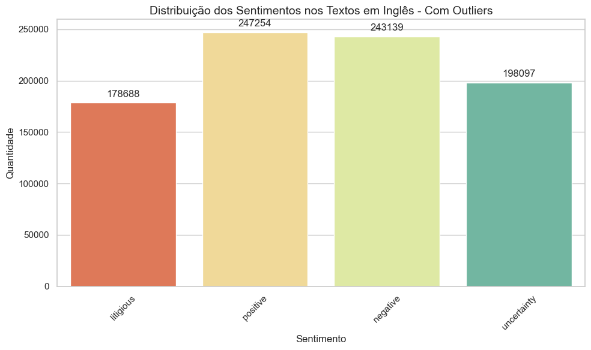
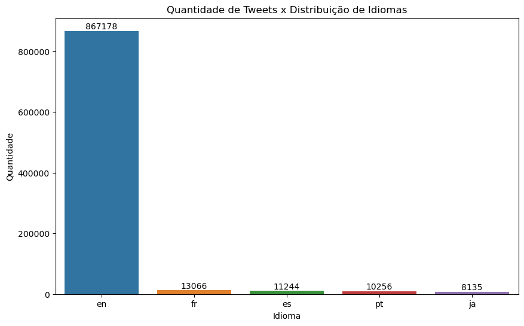

# Preparação dos dados

A preparação de dados é um componente crítico no processo de aprendizado de máquina, que diretamente influencia a performance e eficácia dos modelos construídos. No contexto do conjunto de dados "**Sentiment Dataset with 1 Million Tweets - MUHAMMAD TARIQ**", utilizamos um conjunto abrangente de técnicas de pré-processamento e tratamento de dados para maximizar a qualidade e a relevância das informações disponíveis.

## **Limpeza de Dados**

Neste projeto, a limpeza de dados incluiu as seguintes etapas:

- Remoção de expressões regulares(Urls, menções, hashtags e caracteres especiais);
```python 
# Função de limpeza de texto para remover URLs, menções, hashtags, caracteres especiais e números
def clean_text(text):
    if pd.isnull(text):
        return text
    text = re.sub(r'http\S+', '', text)  # Remover URLs
    text = re.sub(r"www.\S+",'', text)  # Remover URLs
    text = re.sub('@[A-Za-z0-9_]+','',text)  # Remover menções
    text = re.sub('#[A-Za-z0-9_]+','',text)  # Remover hashtags
    text = re.sub(r'[^a-zA-Z\s]', '', text)  # Remover caracteres especiais e números
    text = re.sub(r'\s+', ' ', text).strip()  # Remover espaços extras
    return text

# Aplicando a limpeza de texto na coluna 'Language'. Foram encontrados links de imagens, o que não é relevante para a análise
df['Language'] = df['Language'].astype(str).apply(clean_text)

df.drop(df[df['Language'].astype(str).apply(lambda x: len(x) > 3)].index, inplace=True)

# Aplicando a limpeza de texto na coluna 'Text' para remover URLs, menções, hashtags, caracteres especiais e números
df['Clean_Text'] = df['Text'].astype(str).apply(clean_text)
```

- Remoção de Stop Words (palavras comuns que aparecem com frequência, mas não agregam sentido/valor à frase, exemplo, artigos e preposições, o/a/um/e...);
```python
# Remover stopwords
stop_words_en = set(stopwords.words('english'))

def remove_stopwords(text):
    tokens = text.split()
    filtered_tokens = [token.lower() for token in tokens if token.lower() not in stop_words_en]
    return ' '.join(filtered_tokens)

df_english.loc[:, 'Clean_Text'] = df_english['Clean_Text'].apply(remove_stopwords)
```

- Outliers, identificados usando os quantis 0.05 e 0.95 para o comprimento do texto, foram removidos para minimizar o viés nos resultados da análise;


>Gráfico: Distribuição dos Sentimentos nos Textos em Inglês - Com Outliers
 
```python
# Identificando outliers no comprimento do texto com base 
outliers = df[(df['Text_Length'] > df['Text_Length'].quantile(0.95)) | (df['Text_Length'] < df['Text_Length'].quantile(0.05))]
print("Outliers identificados:", len(outliers))
```
>Outliers identificados: 88.239

```python
# Quantidade de outliers por rótulo
outliers['Label'].value_counts()
```
>`negative`: 29.282
>
>`positive`: 28.636
>
>`litigious`: 17.628
>
>`uncertainty`: 12.693

```python
# Removendo outliers com base no comprimento do texto (5% dos dados com menor e maior comprimento) para evitar viés na análise
df_filtered = df[~((df['Text_Length'] > df['Text_Length'].quantile(0.95)) | (df['Text_Length'] < df['Text_Length'].quantile(0.05)))]
```


>Gráfico: Distribuição dos Sentimentos nos Textos em Inglês - Outliers Removidos

- Valores ausentes na coluna 'Language' foram tratados preenchendo-os com uma string vazia; 
```python
# Tratando valores ausentes na coluna 'Language', preenchendo com vazio ('') para evitar problemas na análise de texto
df['Language'].fillna('', inplace=True)
```

- Duplicatas foram eliminadas para evitar redundâncias que poderiam distorcer as análises;
```python
# Remoção de duplicatas
df.drop_duplicates(inplace=True)
```

- Limitação do escopo dos dados apenas para a linguagem inglesa.


>*Gráfico: Distribuição de Quantidade de Tweets x Idiomas*

## **Feature Engineering**
Crie novos atributos que possam ser mais informativos para o modelo; selecione características relevantes e descarte as menos importantes.

## **Tratamento de dados desbalanceados**
Se as classes de interesse forem desbalanceadas, considere técnicas como oversampling, undersampling ou o uso de algoritmos que lidam naturalmente com desbalanceamento.

## **Separação de dados**
Divida os dados em conjuntos de treinamento, validação e teste para avaliar o desempenho do modelo de maneira adequada.

## **Manuseio de Dados Temporais**
Se lidar com dados temporais, considere a ordenação adequada e técnicas específicas para esse tipo de dado.

## **Redução de Dimensionalidade**
Aplique técnicas como PCA (Análise de Componentes Principais) se a dimensionalidade dos dados for muito alta.

## **Validação Cruzada**
Utilize validação cruzada para avaliar o desempenho do modelo de forma mais robusta.

## **Monitoramento Contínuo**
Atualize e adapte o pré-processamento conforme necessário ao longo do tempo, especialmente se os dados ou as condições do problema mudarem.

Entre outras....

# Descrição dos modelos

Nesta seção, conhecendo os dados e de posse dos dados preparados, é hora de descrever os algoritmos de aprendizado de máquina selecionados para a construção dos modelos propostos. Inclua informações abrangentes sobre cada algoritmo implementado, aborde conceitos fundamentais, princípios de funcionamento, vantagens/limitações e justifique a escolha de cada um dos algoritmos. 

Explore aspectos específicos, como o ajuste dos parâmetros livres de cada algoritmo. Lembre-se de experimentar parâmetros diferentes e principalmente, de justificar as escolhas realizadas.

Como parte da comprovação de construção dos modelos, um vídeo de demonstração com todas as etapas de pré-processamento e de execução dos modelos deverá ser entregue. Este vídeo poderá ser do tipo _screencast_ e é imprescindível a narração contemplando a demonstração de todas as etapas realizadas.

# Avaliação dos modelos criados

## Métricas utilizadas

Nesta seção, as métricas utilizadas para avaliar os modelos desenvolvidos deverão ser apresentadas (p. ex.: acurácia, precisão, recall, F1-Score, MSE etc.). A escolha de cada métrica deverá ser justificada, pois esta escolha é essencial para avaliar de forma mais assertiva a qualidade do modelo construído. 

## Discussão dos resultados obtidos

Nesta seção, discuta os resultados obtidos pelos modelos construídos, no contexto prático em que os dados se inserem, promovendo uma compreensão abrangente e aprofundada da qualidade de cada um deles. Lembre-se de relacionar os resultados obtidos ao problema identificado, a questão de pesquisa levantada e estabelecendo relação com os objetivos previamente propostos. 

# Pipeline de pesquisa e análise de dados

Em pesquisa e experimentação em sistemas de informação, um pipeline de pesquisa e análise de dados refere-se a um conjunto organizado de processos e etapas que um profissional segue para realizar a coleta, preparação, análise e interpretação de dados durante a fase de pesquisa e desenvolvimento de modelos. Esse pipeline é essencial para extrair _insights_ significativos, entender a natureza dos dados e, construir modelos de aprendizado de máquina eficazes. 
