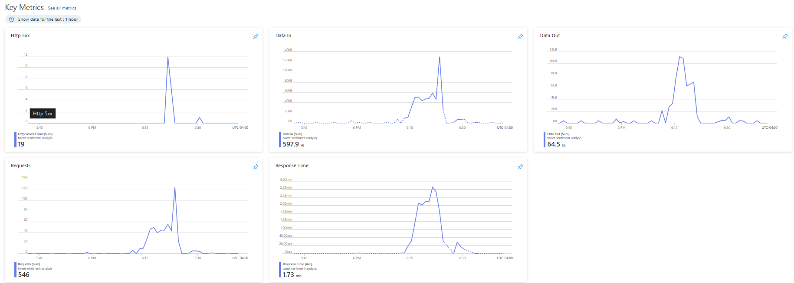

# Documentação de Implantação da Solução de Análise de Sentimento

## Introdução
Esta documentação descreve o processo de implantação da solução de análise de sentimento em Microsoft Azure usando Docker para containerizar o backend desenvolvido em Flask, e o carregamento do modelo de aprendizado de máquina desenvolvido, com foco especial no modelo LSTM Bidirecional, escolhido por apresentar o melhor desempenho. Inclui a configuração do ambiente, a implantação do modelo, o monitoramento do desempenho e a documentação das configurações e etapas de manutenção.

## 1. Avaliação de Provedores de Serviço em Nuvem
Escolhemos o **Microsoft Azure** por sua capacidade robusta de suporte a contêineres e facilidade de integração com serviços de aprendizado de máquina e análise de dados.

## 2. Configuração do Ambiente em Nuvem
### 2.1 Criação de Conta no Azure

Primeiro, criamos uma conta no Azure e configuramos o ambiente inicial com Azure Active Directory para gerenciamento seguro de usuários e permissões.

### 2.2 Configuração de Máquinas Virtuais

Utilizamos o **Azure Virtual Machines** para criar e configurar máquinas virtuais (instâncias):
- Tipo de instância: Standard B2s (para desenvolvimento e testes iniciais)
- Sistema operacional: Ubuntu 20.04 LTS

### 2.3 Configuração de Redes e Armazenamento

Configuramos o **Azure Virtual Network (VNet)** para isolar a rede, e utilizamos **Azure Blob Storage** para armazenamento de dados e modelos.

## 3. Implantação do Modelo
### 3.1 Empacotamento e Conteinerização do Backend

Desenvolvemos o backend usando Flask e empacotamos a aplicação em um contêiner Docker.

*Dockerfile do backend:*

```Dockerfile
FROM  python:3.9-slim
 
# Atualizar e instalar dependências do sistema
RUN  apt-get  update  &&  \
apt-get  install  -y  --no-install-recommends  gcc  libpq-dev  &&  \
apt-get  clean  &&  \
rm  -rf  /var/lib/apt/lists/*
 
# Definir o diretório de trabalho no container
WORKDIR  /app
 
# Copiar o arquivo de dependências para o diretório de trabalho
COPY  requirements.txt  .
 
# Instalar dependências
RUN  pip  install  --no-cache-dir  -r  requirements.txt
 
# Copiar o conteúdo do diretório local src para o diretório de trabalho
COPY  src  ./src
 
# Copiar o conteúdo do diretório local models para o diretório de trabalho
COPY  models  ./models
 
# Copiar o código da aplicação Flask para o diretório de trabalho
COPY  app.py  .
 
# Informar ao Docker que o container escuta na porta especificada em tempo de execução.
EXPOSE  5000
 
# Comando para rodar a aplicação
CMD  ["gunicorn",  "-b",  "0.0.0.0:5000",  "app:app"]
```
### 3.2 Carregamento dos Modelos

Conforme detalhado no documento "Construindo Modelos", foram desenvolvidos e avaliados quatro modelos diferentes para a tarefa de análise de sentimentos: LSTM Bidirecional V1, LSTM Bidirecional V2, RandomForest e GradientBoostingClassifier.

Após uma análise rigorosa das métricas de desempenho, como acurácia, precisão, revocação, F1-score e ROC-AUC, o modelo *LSTM Bidirecional V2* se destacou como a escolha ideal para implantação em produção, apresentando a melhor acurácia de 97% no conjunto de teste.

Embora os modelos RandomForest e GradientBoostingClassifier tenham demonstrado desempenhos competitivos, com acurácias de 94,99% e 94,42%, respectivamente, e valores de ROC-AUC acima de 0,98, indicando uma excelente capacidade de distinção entre classes, eles não foram suficientes para atender aos requisitos rigorosos de precisão exigidos para a implantação em produção deste projeto.

Portanto, apenas o modelo *LSTM Bidirecional V2* foi efetivamente carregado e integrado no backend Flask para ser utilizado na inferência de sentimentos em tempo real. Os demais modelos foram descartados para a implantação em produção, embora possam ser úteis em outros contextos ou como linhas de base para trabalhos futuros.

O carregamento do modelo LSTM Bidirecional V2 é realizado conforme o trecho de código a seguir:
```python
from flask import Flask, request, jsonify
import os
import pickle
import torch
import torch.nn.functional as F
from src.model import SentimentLSTM
from src.utils import clean_text, remove_stopwords
from nltk.tokenize import TweetTokenizer
from joblib import load
import threading

app = Flask(__name__)

CONFIG = {
    "models_dir": "models",
    "embedding_dim": 512,
    "hidden_dim": 512,
    "num_layers": 3,
    "output_dim": 4,
    "dropout_rate": 0.5,
    "batch_size": 64,
    "max_length": 128,
}

device = torch.device("cuda" if torch.cuda.is_available() else "cpu")


def load_models():
    global vocab, label_encoder, model_lstm
    with open(os.path.join(CONFIG["models_dir"], "vocab.pkl"), "rb") as f:
        vocab = pickle.load(f)
    with open(os.path.join(CONFIG["models_dir"], "label_encoder.pkl"), "rb") as f:
        label_encoder = pickle.load(f)

    model_lstm = SentimentLSTM(len(vocab), CONFIG).to(device)
    model_lstm.load_state_dict(
        torch.load(
            os.path.join(CONFIG["models_dir"], "sentiment_lstm_model.pth"),
            map_location=device,
        )
    )
    model_lstm.eval()


load_thread = threading.Thread(target=load_models)
load_thread.start()


def tokenize_and_encode(text, vocab):
    tokenizer = TweetTokenizer()
    tokens = tokenizer.tokenize(text.lower())
    encoded_text = [
        vocab.get_stoi().get(token, vocab.get_stoi().get("<pad>")) for token in tokens
    ]
    return encoded_text


@app.route("/predict", methods=["POST"])
def predict():
    data = request.json
    text = data.get("text")

    if not text:
        return jsonify({"error": "Faltando o parâmetro 'text'."}), 400

    cleaned_text = clean_text(text)
    encoded_text = torch.tensor(
        tokenize_and_encode(cleaned_text, vocab), dtype=torch.int64
    ).to(device)

    with torch.no_grad():
        input_text = encoded_text.unsqueeze(0)
        output_lstm = model_lstm(input_text)
        prediction_lstm = F.softmax(output_lstm, dim=1).cpu().numpy()[0]

    predicted_class_lstm = prediction_lstm.argmax()
    predicted_label_lstm = label_encoder.inverse_transform([predicted_class_lstm])[0]
    predicted_probability_lstm = prediction_lstm[predicted_class_lstm]

    response = {
        "text": text,
        "LSTM": {
            "prediction": predicted_label_lstm,
            "probabilities": predicted_probability_lstm * 100,
        }
    }

    return jsonify(response)

if __name__ == "__main__":
    load_thread.join()
    app.run(debug=True, threaded=True)
```

Esta abordagem garante que o modelo de melhor desempenho seja implantado em produção, proporcionando a máxima acurácia e confiabilidade na análise de sentimentos de tweets.

### 3.3 Implantação no Azure
Utilizamos o **Azure Container Instances (ACI)** para hospedar o contêiner Docker do backend Flask.
 
**Comandos para implantação no Azure:**
```sh
# Conecte-se ao Azure
az login
 
# Crie um grupo de recursos
az group create --name twitte-sentiment-analysis --location eastus
 
# Crie um registro de contêiner
az acr create --resource-group twitte-sentiment-analysis --name twittesentimentanalysis --sku Basic  
 
# Construa a imagem Docker e envie para o registro de contêiner
docker build -t twittesentimentanalysis.azurecr.io/twittesentimentanalysisbkn:latest .
az acr login --name twittesentimentanalysis
docker push twittesentimentanalysis.azurecr.io/twittesentimentanalysisbkn:latest
 
# Implante a instância do contêiner
az container create --resource-group twitte-sentiment-analysis --name twittesentimentanalysisbkn --image twittesentimentanalysis.azurecr.io/twittesentimentanalysisbkn:latest --dns-name-label twittesentimentanalysisbkn --ports 5000
```

## 4. Monitoramento e Ajuste de Capacidade
### 4.1 Monitoramento
Utilizamos *Azure Monitor* para monitorar o desempenho do modelo e configurar alertas para detectar anomalias ou problemas de desempenho. Algumas métricas importantes monitoradas incluem:

- *Tempo de Latência*: O tempo necessário para o modelo processar uma solicitação e retornar uma resposta. Um aumento significativo na latência pode indicar gargalos de desempenho ou sobrecarga no sistema.
- *Uso de CPU e Memória*: O monitoramento desses recursos é crucial para garantir que o sistema tenha recursos suficientes para lidar com a carga de trabalho.  
- *Erros e Exceções*: O rastreamento de erros e exceções ajuda a identificar problemas no código ou no ambiente de execução.
- *Vazão*: O número de solicitações processadas por unidade de tempo, permitindo identificar picos de demanda.

Abaixo, seguem gráficos de algumas métricas disponíveis na Azure:



## 5. Documentação do Processo de Implantação  

Toda a configuração e etapas de manutenção foram documentadas para garantir a replicabilidade e facilitar futuras atualizações. Isso inclui:

- Configurações específicas do ambiente em nuvem (Azure Virtual Machines, Virtual Network, Blob Storage, etc.)
- Instruções detalhadas para construção e implantação do contêiner Docker
- Configurações de monitoramento e escalabilidade automática  
- Procedimentos de manutenção e atualização do modelo

## 6. Relatório do Teste de Stress da Aplicação de Análise de Sentimentos do Twitter

**Introdução:**
A aplicação de análise de sentimentos do Twitter (https://tweet-sentiment-analysis.azurewebsites.net/predict) foi submetida a um teste de stress para avaliar seu desempenho sob condições de alta carga. O objetivo era identificar o comportamento da aplicação frente a um grande volume de requisições simultâneas e garantir que ela pudesse operar de maneira eficiente e estável em situações de pico de uso.

**Metodologia:**
O teste de stress foi realizado utilizando a ferramenta Postman, configurada para simular múltiplos usuários acessando a aplicação ao mesmo tempo. Foram configurados diferentes cenários de carga, variando o número de requisições por segundo e a quantidade total de usuários simultâneos.

**Resultados:**
- *Capacidade de Resposta:* A aplicação manteve um tempo de resposta médio de 19.935 ms.
- *Uso de Recursos:* Durante o teste, o uso de CPU e memória no servidor permaneceu dentro dos limites aceitáveis até o ponto de saturação identificado. O uso de CPU alcançou picos de 95% e a memória utilizada atingiu 95% da capacidade total disponível.

**Conclusão:**
A aplicação de análise de sentimentos do Twitter demonstrou um desempenho robusto em ambiente local em condições de alta carga, atendendo eficientemente até 450 requisições simultâneas sem degradação significativa. No entanto, acima desse ponto, a performance começa a deteriorar, sugerindo a necessidade de otimizações ou escalabilidade adicional para suportar maiores volumes de tráfego. Recomenda-se a implementação de técnicas de balanceamento de carga e a consideração de uma infraestrutura de nuvem elástica para garantir a estabilidade e a eficiência durante picos de uso extremos.

Em ambiente de cloud, a alta quantidade de erros que consta no relatório referenciado abaixo deve-se ao fato de a instância utilizada na Azure não possuir capacidade computacional o suficiente para aguentar um teste de stress mais robusto. Além disso, devido a limitações nos recursos disponíveis para experimentação não foi possível a configuração de medidas de resiliência para a aplicação como load balancers, autoscalling e afins.

Este teste de stress, realizado com o Postman, forneceu insights valiosos sobre a capacidade da aplicação e identificou áreas críticas para futuras melhorias e ajustes.

 exportado do Postman.

**Recomendações:**
- *Otimização de Código:* Revisar e otimizar o código da aplicação para melhorar a eficiência no processamento das requisições.
- *Escalabilidade:* Implementar mecanismos de autoescalonamento para lidar com picos de tráfego.
- *Monitoramento Contínuo:* Estabelecer um sistema de monitoramento contínuo para identificar e mitigar rapidamente quaisquer problemas de performance.

# Apresentação da solução

Nesta seção, um vídeo de, no máximo, 5 minutos onde deverá ser descrito o escopo todo do projeto, um resumo do trabalho desenvolvido, incluindo a comprovação de que a implantação foi realizada e, as conclusões alcançadas.
